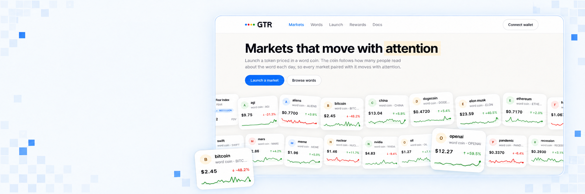

<p align="center">
  
</p>

<h1 align="center">GTR</h1>

<p align="center">
  Markets that move with attention.<br>
  A launchpad on Robinhood Chain where every token is priced in a word coin, and every word coin is priced by how many people read about that word today.
</p>

<p align="center">
  <a href="https://gtrpad.com">Live app</a> ·
  <a href="https://github.com/gtrpad/gtr">GitHub</a> ·
  <a href="#how-it-works">How it works</a> ·
  <a href="#contracts">Contracts</a> ·
  <a href="#run-it-yourself">Run it yourself</a>
</p>

## The idea in one paragraph

Attention is the only asset nobody can print. GTR turns it into a quote currency. Each word in the catalogue gets its own ERC20, the word coin. Its price is not discovered by trading. It is set once a day by an oracle that reads how many people opened the word's Wikipedia article: one thousand views is one dollar. A meme token launches on a bonding curve denominated in that coin, migrates into a Uniswap v4 pool, and pays its holders their share of fees in the same coin, automatically, every fifteen minutes. When the world starts talking about a word, its coin goes up, and every market paired with it goes up in dollars without a single trade.

Hold RECESSION and you hold the fear of the market. Hold AGI and you hold the hype. No index, no futures desk, no leverage. Just words.

## How it works

```
                 Wikipedia pageviews          USDG
                        │                       │
                        ▼                       ▼
                 AttentionFeed ───────────► PegVault ──► word coin (RECESSION, AGI, GOLD…)
                 price = views / 1000        mint / redeem at feed price
                                                        │
                                                        ▼
                                              Launchpad curve (800M tokens)
                                              opens at $5,000, migrates at $35,000
                                                        │
                                                        ▼
                                              Uniswap v4 pool, liquidity locked forever
                                                        │
                                          fees: 40% holders · 30% buyback · 30% exchange
```

**Word coins.** Every catalogue word maps to one Wikipedia article. The keeper reads yesterday's views, pushes the price to the feed, and the vault mints coins for USDG at that price. Selling burns coins and pays USDG out of what that word has collected. A coin is redeemable only up to its own reserve, and a feed that has not been updated for 36 hours pauses trading in that word until it is refreshed. Both limits are on chain and visible on every word page.

**Markets.** Anyone launches a token in one transaction: name, ticker, image, the word to pair with, a trading fee of 1, 2 or 3 percent, and an optional first buy in ETH or USDG. Supply is one billion. Eight hundred million sell on a virtual constant product curve that opens at a $5,000 cap and completes at $35,000. Both caps are converted to the word coin at creation and then fixed in the coin, which is exactly why a rally in the word lifts the market in dollars without moving it along the curve.

**Migration.** The buy that takes the last curve token also opens the pool. The raised coin and the reserved two hundred million tokens move into a Uniswap v4 pool at the final curve price. The launchpad holds the position and has no function to withdraw it. The creator's fee becomes the pool's LP fee, so nothing changes for traders.

**Fees.** Every trade pays the market's fee, on the curve and in the pool. Forty percent goes to holders of that market in the word coin it is paired with. Thirty percent buys the exchange coin and burns it. Thirty percent runs the exchange. Creators get nothing, on purpose. They are paid like everyone else, by holding.

**Rewards.** There is nothing to claim. The keeper reads holder balances from its own index of transfer events and pays each wallet its share once a market has at least $100 unpaid, counting wallets that hold at least $5 and skipping payouts under $1. Word coins arrive in the wallet and can be held or sold back to the vault for USDG.

## Routes in one transaction

Pay with ETH, USDG or the word coin itself. The router chains every hop: ETH to USDG on the ETH/USDG pool, USDG to the word coin through the vault, the coin into the curve or the v4 pool, and hands the tokens back. Selling runs the same route in reverse. Quotes come from the router itself, which runs the route inside a simulation and reverts with the result, so the number on the screen is the number on chain.

## Contracts

Robinhood Chain, chain id 4663. Every address below is live.

* **AttentionFeed** `0x99dd7e5A1Db7614808AbD88E88EE70913cB1381E` reference price of every word coin, written by the keeper
* **PegVault** `0xBf1Aa5f9050bBD5F6155aCF04085748294a40ae4` mints and redeems word coins against USDG at the feed price
* **Launchpad** `0xaF881cCe7BcCf8Aaebc07848578c88c3823d1314` markets, curves, migration, fee ledger
* **Router** `0x4a67f32cCAA59DBdcdF1f6E3eBCFB1E8c6250F3D` ETH, USDG and word coin routes, quotes
* **Buyback** `0xa141A80f3A0457ABd8aC4d876CfA991d406ac9F1` buys the exchange coin with ETH and burns it
* **Disperse** `0x24E6B1e40f372EF1a72f7cAC85A4Ae95c521629F` holder payouts in one transaction
* **Uniswap v4 PoolManager** `0x8366a39CC670B4001A1121B8F6A443A643e40951` holds every migrated pool
* **USDG** `0x5fc5360D0400a0Fd4f2af552ADD042D716F1d168` quote of the vault

The contracts are plain Solidity 0.8.26 on Foundry. There is no hook: the creator's fee is the pool's LP fee and the launchpad collects it by touching its own position. Word coins and launch tokens are minimal ERC20 clones, so a new word costs about the gas of a transfer.

## Repository

```
contracts/   Foundry project: sources, tests, deploy script
web/         Next.js app: public site, admin panel, API, worker
```

The worker runs three loops in one process: an indexer that reads launchpad, router, pool and transfer events into Postgres; an oracle that observes Wikipedia once a day and pushes the feed; and a keeper that collects fees, pays holders, converts treasury shares and runs the buyback. Every action lands in a journal the operator can read.

## Run it yourself

You need Node 22, Foundry and Postgres.

Contracts:

```
cd contracts
forge install OpenZeppelin/openzeppelin-contracts@v5.1.0 Uniswap/v4-core Uniswap/v4-periphery
forge test
```

The test suite includes a fork test against Robinhood Chain that walks the whole route on the real pool manager, the real USDG and the real ETH/USDG pool. Set `RH_RPC_URL` to run it.

Web:

```
cd web
npm install
cp .env.example .env
npx prisma db push
npm run seed:words
npm run dev
npm run worker
```

The site listens on port 3500. The admin panel lives at `/admin`.

## Oracle notes

The feed is deliberately simple. One word, one article, one number a day, floor of $0.001. Views are a proxy for attention and can be gamed in the short term, articles can be renamed, and a spike rescales nothing because the price uses raw views rather than a normalised index. The catalogue is curated by the operator for that reason, and every word page shows the article it tracks.

## License

MIT
